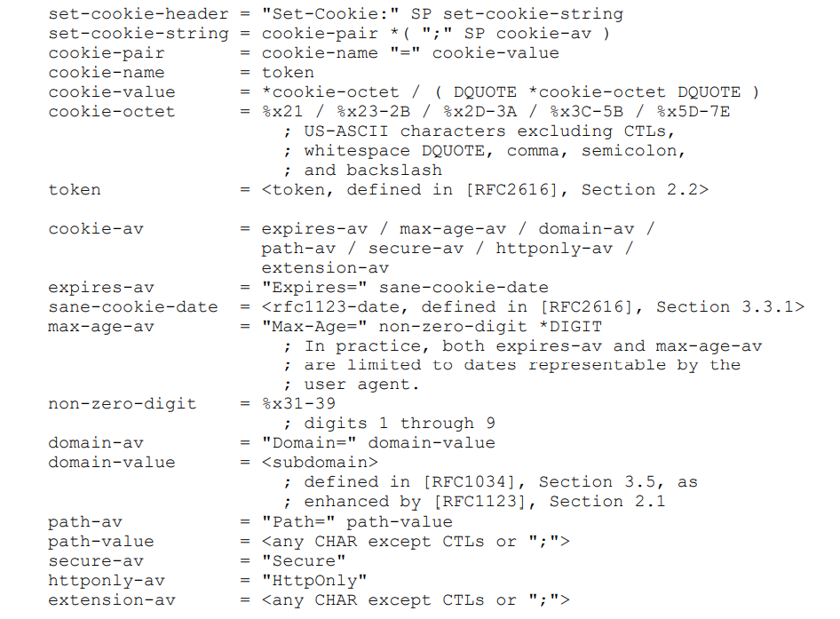
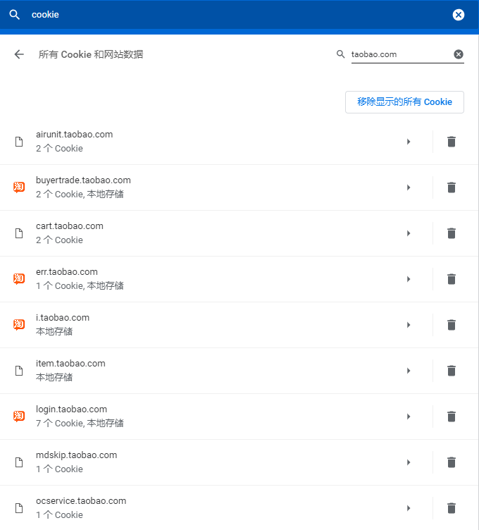

- [什么是cookie](#什么是cookie)
    - [RFC6265:HTTP State Management Mechanism](#rfc6265http-state-management-mechanism)
        - [Introduction](#introduction)
        - [Overview](#overview)
        - [Server Requirements](#server-requirements)
            - [Set-Cookie字段](#set-cookie字段)
            - [Cookie字段](#cookie字段)
        - [User Agent Requirements](#user-agent-requirements)
        - [Privacy Considerations，隐私考虑](#privacy-considerations隐私考虑)
            - [Third-Party Cookies，第三方Cookie](#third-party-cookies第三方cookie)
            - [Ambient Authority，基于Cookie的认证方式](#ambient-authority基于cookie的认证方式)
            - [Weak Confidentiality](#weak-confidentiality)
    - [Questions](#questions)
    - [Reference](#reference)

# 什么是cookie

这篇文章探讨Cookie的由来、什么是Cookie，以及Cookie的常见应用场景等内容。本文部分内容来自于RFC，部分来自于各种博客。内容不算深刻，也没有什么独到的见解，请客观参考。

## RFC6265:HTTP State Management Mechanism

RFC6265是最新的HTTP Cookie标准，定义了HTTP状态管理机制。本节主要是对RFC的翻译。

### Introduction

HTTP协议在头部使用`Cookie`和`Set-Cookie`两个字段来控制cookie，进而实现HTTP状态管理。Cookie简单来说就是一个key-value对，以及一些用来描述cookie的元数据(metadata)，比如过期时间、适用范围等。由于历史原因，Cookie有一些安全问题，比如Cookie滥用等。

在HTTP状态管理机制中，主要有两个角色：

* 生产cookie的服务器， cookie-generating servers
* 消费cookie的客户端，cookie-consuming user agents

### Overview

这里简要介绍cookie的工作方式,举几个例子.

不带任何属性的cookie使用方式：
```
 == Server -> User Agent ==
 Set-Cookie: SID=31d4d96e407aad42
 == User Agent -> Server ==
 Cookie: SID=31d4d96e407aad42
```


带有作用域(域名、路径)的cookie使用：
```
 == Server -> User Agent ==
 Set-Cookie: SID=31d4d96e407aad42; Path=/; Domain=example.com
 == User Agent -> Server ==
 Cookie: SID=31d4d96e407aad42
```

设置多个cookie，并附加更多属性：
```
 == Server -> User Agent ==
 Set-Cookie: SID=31d4d96e407aad42; Path=/; Secure; HttpOnly
 Set-Cookie: lang=en-US; Path=/; Domain=example.com
 == User Agent -> Server ==
 Cookie: SID=31d4d96e407aad42; lang=en-US
```

通过Expires属性来删除cookie：
```
 == Server -> User Agent ==
 Set-Cookie: lang=; Expires=Sun, 06 Nov 1994 08:49:37 GMT
 == User Agent -> Server ==
 Cookie: SID=31d4d96e407aad42
```

### Server Requirements

这一节提出了HTTP Server应该如何处理`Cookie`和`Set-Cookie`两个字段。

#### Set-Cookie字段

基本语法是`Set-Cookie: key=value(;Cookie-Av )*`,Cookie-Av指一系列的cookie属性。这是更规范的语法定义：



server必须遵守：
* 如果要设定多个cookie，不能压缩在一个Set-Cookie字段中，必须分开  
* 如果通过多个socket，向同一个user agent发送Set-Cookie字段，可能带来潜在的资源竞争，导致未定义行为  
* 如果要删除cookie，server可以通过设置过期的Expires值达到目的
* 除非是指定了相关作用范围，cookie只被user agent发回给origin server，并且不返回给任何subdomain

下面介绍几个现有的cookie属性：
* `Expires`，过期时间，通常是一个时间字符串。如果过期，user agent就不必继续保存这个cookie。  
* `Max-Age`，过期时间，以秒为单位。这个属性和`Expires`差不多，但优先级更高。  
* `Domain`，作用域名。一般包含子域名，比如`Domain=qq.com`对`www.qq.com`、`v.qq.com`都有效，但对`www.weixin.qq.com`无效。注意，user agent会拒绝保存超出domain范围的cookie，比如`example.com`发过来的`Domain=site1.example.com`的cookie会被接受，但`example.com`发过来的`Domain=subsite1.site1.example.com`或`Domain=anotherexample.com`的cookie会被拒绝保存。  
* `Path`  

后面的几个cookie属性涉及到安全问题，我认为不可靠，不能作为安全措施来使用：
* `Secure`，表明这个cookie只能在`安全`的传输通道中使用。这个`安全`由user agent定义，通常指HTTPS连接，或者其他。
* `HttpOnly`，表明cookie只能在HTTP请求中使用,而不能在非HTTP API中使用，比如浏览器的API。

#### Cookie字段

server对于Cookie字段的要求很少，如下：
* user agent发送回来的Cookie不带有属性，只是单纯的key-value
* server不能对Cookie对的先后顺序有任何假设

### User Agent Requirements

这一节提出了User Agent对于Cookie应该遵循的处理细节。限于篇幅和时间，这里不再展开。

（实际是我不想看RFC了，逃

### Privacy Considerations，隐私考虑

#### Third-Party Cookies，第三方Cookie

User agent访问A站点时，可能因为A站点带有B站点的资源（比如图片、脚本等），从而访问B站点。这里，B站点就是User agent和A站点的第三方。如果User agent访问B时，带上了一些Cookie，那么B就可以记录下来。等到User agent再访问C站点，而且C恰好也有B的资源，User agent会再次访问B站点。如果User agent又发送了相关Cookie，那么B就能甄别User agent，并根据其历史访问行为做点事情了。

第三方Cookie常用于广告和个性化推荐。比如你常用京东搜一些商品，然后京东在后台记下了相关的关键词，并在User agent种下了某个Cookie。下次你再访问CSDN，由于CSDN常带有京东的广告栏，你的User agent会去访问京东，并带上京东种好的Cookie，于是京东可以根据你的历史行为生成广告推荐，返回给你的User agent，并再CSDN的页面上显示出来。同时，CSDN有可能把这些推荐内容进行处理，从而推断你在京东的历史浏览行为。

这里存在一个隐私问题：CSDN拿到了我们在京东的相关数据。细细想来，背后可能存在一条Cookie产业链，还是非常可怕的。实际上除了Cookie，还有其他机制可以达到类似的用户跟踪效果，比如定制的URL。

#### Ambient Authority，基于Cookie的认证方式

很多站点喜欢用Cookie来维持用户的登陆态。抛开简单形式（直接把信息存到Cookie里，由user agent维护存储），用户的相关登录信息存储在服务端，以session形式来组织，由服务端维护session相关数据；user agent只维护一个session id，并在每次请求时把这个id写到cookie字段里，从而实现认证、鉴权、追踪。

但是呢，有人认为这个方式不合适。因为服务端需要额外维护session的存储，在分布式环境中还要保证每台服务器都能访问到session数据；另一方面，cookie由于path、domain等属性，不适合跨域。所以就有人提出新的认证方式：Json Web Token。具体可以参考(阮一峰的教程)[http://www.ruanyifeng.com/blog/2018/07/json_web_token-tutorial.html]

不过呢，我们看看淘宝、京东、腾讯视频、优酷等站点，发现他们使用了大量的cookie。特别是淘宝，我的浏览器里就存在这些cookie：


也就是说，Token并没有那么流行，至少在这些业务复杂的大型网站系统里，还没有被广泛使用。Cookie仍是一种流行的技术，并且如何管理cookie背后的session也是常用的业务逻辑。


#### Weak Confidentiality

Cookie机制还有一些缺点：

* 不提供端口隔离。如果一台服务器的80端口背后的Web服务制定了一系列的cookie，同时8080端口后有另一个相同的Web服务，那么二者可能会混用cookie。至于为什么一台服务会有两个相同的web服务，这就要问开发者了。

* 不提供事务隔离。cookie不仅被用于HTTP、HTTPS，也可被用于ftp、gopher。现有的cookie机制缺乏针对协议的隔离，通过HTML中的`document.cookies` API，可以访问到相关cookie。

## Questions

* 什么是Cookie2/Set-Cookie2

* 什么是jsonp

* 比较cookie、session、jwt

## Reference

* [RFC6265:HTTP State Management Mechanism](http://www.rfc-editor.org/pdfrfc/rfc6265.txt.pdf)

* [Autho0:Token Based Authentication Made Easy](https://auth0.com/learn/token-based-authentication-made-easy/)

* [阮一峰:JSON Web Token 入门教程](http://www.ruanyifeng.com/blog/2018/07/json_web_token-tutorial.html)