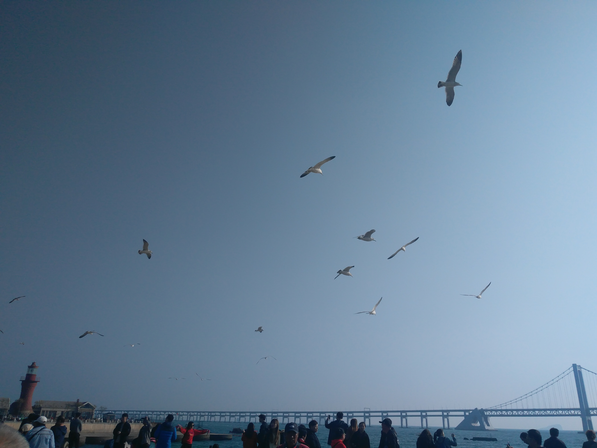
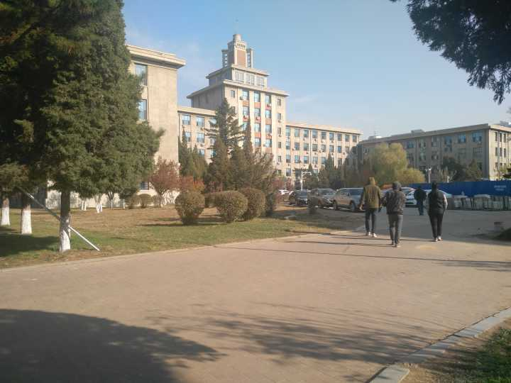
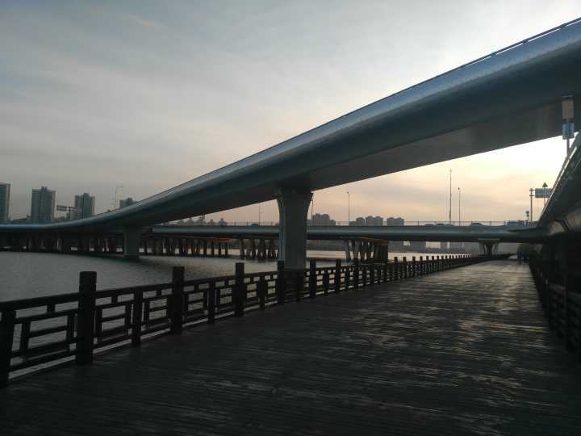
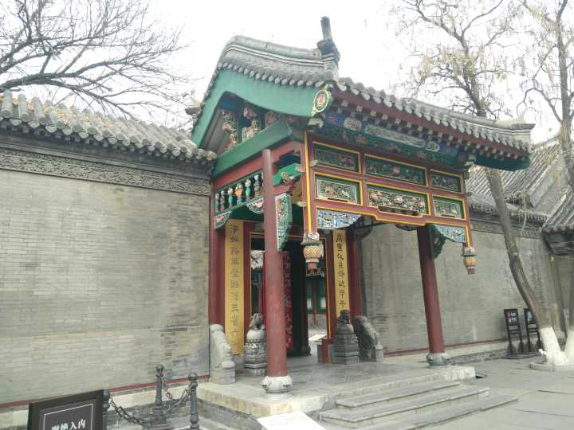
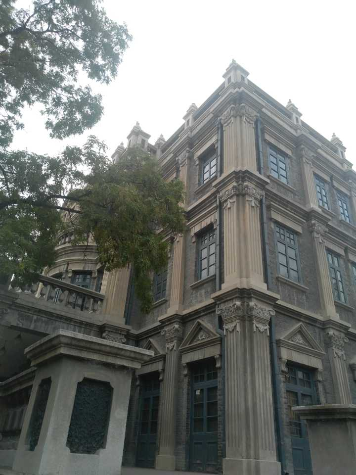
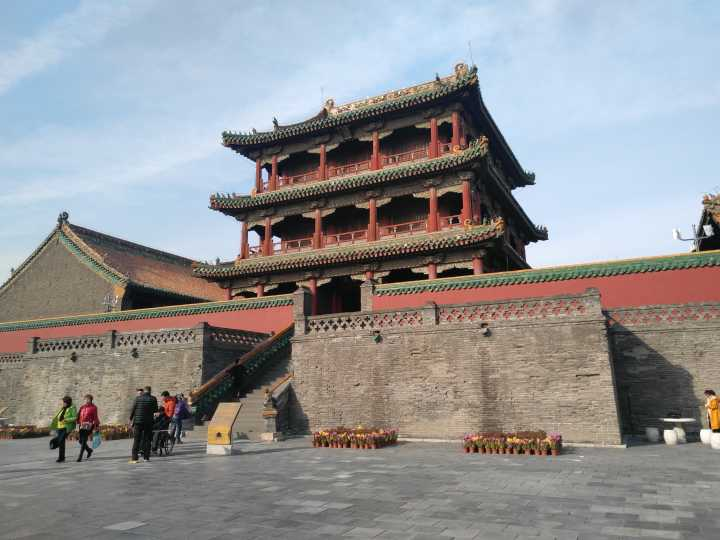

# 我们为什么要旅行

近来，我游荡在各个城市之间，混迹于车站、宾馆、商场、大学和一些莫名其妙的地方。时间一长，难免会思考此行的意义，为什么要折腾？为什么要烧钱？旅行前后的我又有什么不一样呢？

想来还是要记录心上的想法，免得日后一点也记不起来，到底去了什么地方，看到了什么，当初又想过什么。

这篇文章会充满个人观感，不具有普适性。

## 前言

曾经文艺过，读过余秋雨，也读过大冰。那些年总是很感动，觉得旅行真是一件高大上的事情。也想过要领略书上的风景，看看究竟是他们笔下的阳春白雪，还是更加真实的下里巴人。可后来遇到了更感兴趣的事情，没有时间考虑去旅行，也懒得到处跑浪费时间。

如今的心境大不相同。比以往更加麻木，也更加强大。很难再被什么东西打动，也不会像以前那样纯粹地看完一本书，仿佛一切都是稀松平常的小事，所谓生命也不过是祖辈生命的某种重复。大一时还喜欢拍点好看的风景，现在连打开相机的欲望都少了很多。这次旅行的出发点也不过是**自我救赎**，看看能不能滤掉不好的性格。

这次旅行，一在救赎，二在访友，三在消磨时光。

## 第一站，大连

还是免不了俗套，要按照这种时间顺序来阐述所有事情。

在大连的两天，我主要是调整心态。在学校混了这些天，差点变成自闭青年。一下飞机就去找友人A、B，放下行李后吃了顿饭，之后就开始燃烧卡路里。先后逛了星海广场、东港、十五库、俄罗斯/日本风情街，以及各种商场。最喜欢的地方是星海广场，大批鸽子介于人工饲养和自然野生的状态，我和它们相看两不厌，并且保持着微妙的距离。

在这个日常10摄氏度的季节，大连真的是索然无味。最好玩的地方可能是游乐场，但季节限制了人流量也限制了我的热情；其次可能是棒棰岛，毕竟是当代人物住过的地方；再次可能是金沙滩，和游乐场有些相似。至于老虎滩的海洋世界之流，更是不值一提。

友人AB还是相当给力，耐着性子陪我**走**了两天。在这一点上我可能没有变：**喜欢到处瞎走，没有意义，也无所谓方向**。我也很习惯和AB的交流方式，和高中时代区别不大，可以嬉皮笑脸疯狂吐槽，也能聊聊深层次的话题。A没有怎么变，至少在我的视角是这样的；B就如同高中末期显现出的那样，趋向成熟。

期间我开始考虑食宿和行程等各种计划。起码知道火车站周边永远是人流量巨大并且脏兮兮；网上各种旅游攻略是真的能吹，某些名字唬人的景点不过是个人人参与的谎言；消费永远是城市的主旋律，不要幻想什么自然人文景观至上，奶茶、电影、购物才是大家出来走动的关键活动；新房子总是和人烟稀少的商场一起出现。

在大连的最后一晚，和几个许久没有交流过的朋友通了电话，互相交换一下当前状态、未来规划，意识到大家其实都一样，没有谁比谁特殊。所谓的“过人之处”只是机缘巧合，大家不过是顺着机遇做了点微小的事情。

如果非要盖棺定论，大连没有带来惊喜，也谈不上失望。

## 第二站，沈阳

这篇文章从到沈阳的第一天开始写，所以接下来会更加细致，形同日记。

对于沈阳，我要从吐槽开始。

* 酒店十分破旧，卫生不太好，我也查了下其他酒店，似乎所有“经济型”酒店都存在类似的差评：破，脏，服务态度差  
* 沈阳站周围有好多商场，美名其曰步行街。我感觉非但没有什么都市的高端B格，反而因为遍地的刺耳东北话、嘈杂的背景音乐、乱七八糟的行人，透漏出一种城乡结合部的气息
* 司机真的是有特色。满嘴的口音大大咧咧，似乎是特意凸显自己的“风流”、“豁达”。一边开车，一边跟同样口音感人的中年女人撩骚，还时不时的跟兄弟聊今天的日常。我真的是讨厌司机在bb，不管他的聊天对象是不是我

第一天去探望了友人C。C没有变化，跟我印象中一摸一样。逛校园，吃饭，喝奶茶，再逛校园，伴随着一路的东拉西扯，十分愉快。

独自回宾馆的路上，突然开启了贤者模式。觉得这种旅行其实也没有什么意义。又看了看地图，直到把地图看穿也没有特别特别想去的地方，不免对后续日程产生了担忧。

第二天还是和C厮混。逛了老校区，觉得一般般，只是人多。晚上去万达吃饭，店家做了一条没有味道的香辣烤鱼，淡然无味。有点怀念江边城外了。和C的道别是在地铁上，一个挥手，一个眼神。

第三天在中街、沈阳故宫和张氏帅府。中街暂且不表，商场都一个样，即使带上所谓东北特色也不会增色。所谓故宫，只不过是仗着历史蹭些名气，远不如北京故宫，私以为没有半点文化底蕴。不过张氏帅府还是让人眼前一亮的。帅府比故宫略小，每个房间都在讲张学良。一想到当年劝蒋、囚蒋、送蒋，先辈的气度真真不俗，让人心神往之。这两个地方给人一种很奇怪的感觉，强调我们东北当年如何如何，清帝发家如何如何，大帅平生如何如何；讲述历史没有任何错，但我这个人对东北有一点偏见，以前还不觉得，如今只觉得分外凸显，这种偏见加在故宫和帅府上，就让人产生莫名的厌恶。

所谓旅行，于我是换一种生活状态。行走时带着散漫，没有目的，不指望看到什么当地民俗，纯粹喜欢走在无人认识的街道上，用沉默和步伐去对抗人群；参观时由着好奇，挑三拣四，也不期望被名人、历史触动，偶有所感，就觉得是机缘巧合，与先人不谋而合。与平日最大的不同，在于**没有目的**，心神能够有所放松。如果遇到极有特色之处，还会带来极大的、短暂的愉悦。

这种生活状态没什么了不起的，和日常没有高下之分，都是再平常不过的事情。